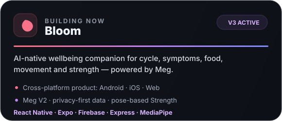
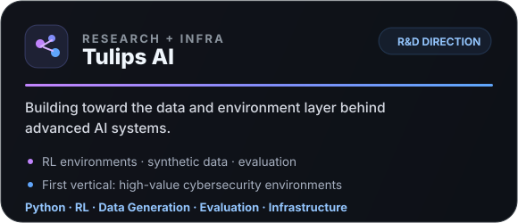
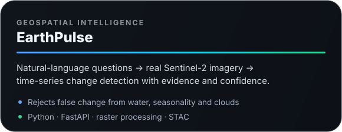
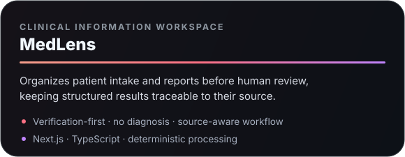

<div align="center">


<br/>

<a href="https://git.io/typing-svg">
  
</a>

<br/>


</div>

---

## `01 // ABOUT`

> ### I build systems, not demos.

I'm **Subramanya Chary** — founder, AI engineer and product builder.

I like problems where software has to survive contact with the real world: **messy users, imperfect data, edge cases, latency, safety constraints and systems that break in ways the demo never predicted**.

Right now I'm building across **AI-native health, reinforcement-learning environments, synthetic data, AI evaluation and intelligent product infrastructure**.

```text
FOUNDER MODE
────────────────────────────────────────────────────
idea          → prototype
prototype     → real system
real system   → failure
failure       → understanding
understanding → better system
────────────────────────────────────────────────────
```

---

## `02 // BUILDING NOW`

<div align="center">

<a href="https://github.com/kandukurinomusubramanyachary-ai/BLOOMv3"></a>


</div>

<br/>

**🌷 Bloom — ACTIVE BUILD**  
AI-native wellbeing companion for cycle, symptoms, food, movement and strength — powered by **Meg**, Bloom's supportive AI system.  
`React Native` `Expo` `Firebase`

**🧠 Tulips AI — R&D DIRECTION**  
Building toward the data + environment layer for advanced AI: **RL environments, synthetic data, evaluation and data infrastructure**. First vertical: **cybersecurity**.

---

## `03 // SELECTED ENGINEERING`

<div align="center">

<a href="https://github.com/kandukurinomusubramanyachary-ai/EARTHPULSE"></a>
<a href="https://github.com/kandukurinomusubramanyachary-ai/Medlens"></a>

</div>

<br/>

**🛰️ EarthPulse** — natural-language questions → real **Sentinel-2 imagery** → time-series change detection → evidence.  
`Python` `FastAPI` `Remote Sensing` `Geospatial AI`

**🩺 MedLens** — organizes patient intake and reports before human review while keeping structured information traceable to the original source.  
`Next.js` `TypeScript` `Health Tech`

---

## `04 // SYSTEM TELEMETRY`

<div align="center">


<br/>


<br/><br/>


</div>

---

## `05 // CONTRIBUTION SIGNAL`

<div align="center">


</div>

---

## `06 // TECH`

<div align="center">


<br/><br/>

`Python` · `TypeScript` · `React` · `Next.js` · `Node.js` · `FastAPI` · `PostgreSQL` · `Supabase` · `Firebase` · `Docker`

</div>

---

## `07 // RESEARCH RADAR`


My current curiosity lives around the infrastructure behind increasingly capable AI:

**RL environments** · **synthetic data** · **AI evaluation** · **agent systems** · **multimodal intelligence** · **data infrastructure**

---

## `08 // HOW I BUILD`

```text
subbu@founder:~/system$ ./build

[01] find      → a painful problem
[02] reduce    → it to the smallest real test
[03] build     → an actual working system
[04] observe   → where reality breaks the assumptions
[05] measure   → the failure modes
[06] repair    → the system, not just the demo
[07] ship      → again

STATUS: continuously iterating
```

> **Working evidence > impressive mockups.**

---

## `09 // CONNECT`

<div align="center">

<a href="https://github.com/kandukurinomusubramanyachary-ai"></a>


<br/><br/>

### `Building things that probably shouldn't exist yet.`

<sub>Founder • AI Engineer • Product Builder</sub>

</div>

