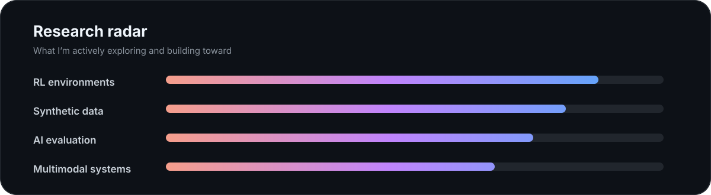

<div align="center">



<br/>

[](https://git.io/typing-svg)

</div>

## About

I'm **Subramanya Chary**, a founder and AI engineer focused on turning ambitious ideas into working products.

My work sits at the intersection of **AI systems, product engineering, health technology, geospatial intelligence, reinforcement-learning environments, synthetic data and AI evaluation**.

I care about three things: building fast, understanding the system deeply, and making the final product useful in the real world.

<table>
<tr>
<td width="50%" valign="top">

### 🌷 Bloom

An AI-native health and wellbeing product built around cycle, symptom, food, movement and strength tracking — with **Meg**, Bloom's supportive AI system.

**Now building:** Bloom v3

`React Native` `Expo` `Firebase` `Express` `MediaPipe` `AI orchestration`

[Explore Bloom v3 →](https://github.com/kandukurinomusubramanyachary-ai/BLOOMv3)

</td>
<td width="50%" valign="top">

### 🧠 Tulips AI

Exploring the infrastructure layer behind advanced AI systems: **data generation, data labeling, evaluation, synthetic data and RL environments**.

**Current direction:** reinforcement-learning environments, starting with high-value verticals such as cybersecurity.

`Python` `RL` `Synthetic Data` `Evaluation` `Data Infrastructure`

</td>
</tr>
</table>

## Selected engineering

<div align="center">

<a href="https://github.com/kandukurinomusubramanyachary-ai/BLOOMv3">
  
</a>
<a href="https://github.com/kandukurinomusubramanyachary-ai/EARTHPULSE">
  
</a>

</div>

### 🛰️ EarthPulse

A working geospatial intelligence prototype that lets users ask questions about Earth in natural language, retrieves **real Sentinel-2 satellite imagery**, compares change across time, rejects false change and explains the evidence.

The interesting engineering problem isn't merely detecting change — it's avoiding confident false positives caused by clouds, seasonality, illumination shifts, receding water and other spectral traps.

[Read the EarthPulse engineering story →](https://github.com/kandukurinomusubramanyachary-ai/EARTHPULSE)

## Research radar



## Engineering stack

<div align="center">


</div>

<br/>

**AI / systems** — LLM orchestration · RL environments · synthetic data · evaluation · multimodal systems · computer vision

**Product** — React Native · Expo · Next.js · TypeScript · Node.js · FastAPI

**Infrastructure** — PostgreSQL · Firebase · Supabase · Docker · REST APIs · GitHub Actions

## How I build

```text
01  Find a painful problem
02  Build the smallest real system that can test the idea
03  Measure where it fails
04  Fix the hard failure modes, not just the demo
05  Ship again
```

I prefer **working prototypes with evidence** over polished mockups with no system behind them.

## GitHub pulse

<div align="center">


</div>

<div align="center">


</div>

---

<div align="center">

### Building things that probably shouldn't exist yet.

<sub>Founder · AI Engineer · Product Builder</sub>

</div>
