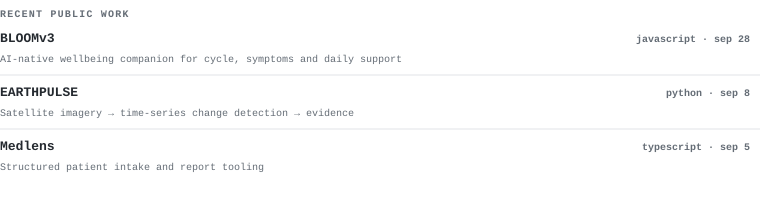
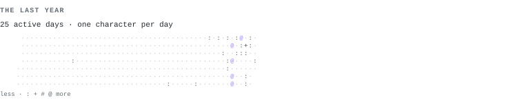
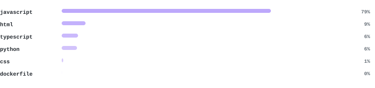

<div align="center">



</div>

> Founder, AI engineer, and product builder. I like turning ambitious ideas into systems that survive real users, messy data, edge cases, and iteration.


**[Bloom](https://github.com/kandukurinomusubramanyachary-ai/BLOOMv3)** · `React Native` `Expo` `Firebase`  
AI-native wellbeing companion for cycle, symptoms, food, movement, strength, and supportive AI experiences.

**Tulips AI** · `RL environments` `synthetic data` `evaluation`  
R&D around the data and environment layer for increasingly capable AI systems.




**[EarthPulse](https://github.com/kandukurinomusubramanyachary-ai/EARTHPULSE)** · `Python` `FastAPI` `Geospatial AI`  
Natural-language questions → satellite imagery → time-series change detection → evidence.

**[MedLens](https://github.com/kandukurinomusubramanyachary-ai/Medlens)** · `TypeScript` `Health Tech`  
Structured patient intake and report tooling designed to keep information traceable to its source.


<div align="center">






</div>


`Python` · `TypeScript` · `React` · `Next.js` · `Node.js` · `FastAPI` · `PostgreSQL` · `Firebase` · `Supabase` · `Docker`

```text
subbu@founder:~/system$ ./build

find a painful problem
    ↓
reduce it to the smallest real test
    ↓
build → observe → measure → repair
    ↓
ship again
```


This profile generates its own graphics. A scheduled GitHub Action reads public activity from the **GitHub GraphQL API**, redraws the SVGs in this repository, and commits only files that actually changed.

No external stats dashboards are required for the telemetry above. The contribution map, streaks, language totals, recent-work panel, and hero status are all produced here in the profile repository.

<sub>Inspired by the idea of treating a GitHub README like a tiny publishing system rather than a static bio.</sub>
